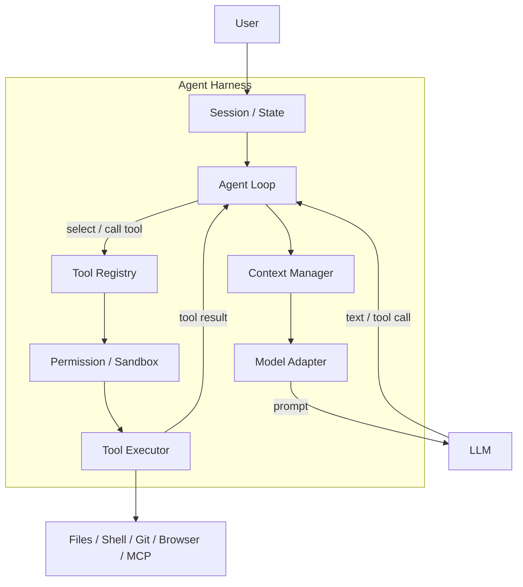

# 核心模块

### Session/State

>[!abstract]
>保存当前会话、任务状态和历史信息。

类似：
>[!example]
>Session
├─ conversation
├─ current workspace
├─ changed files
├─ tool history
├─ current task
├─ plan
└─ metadata
### Agent Loop

>[!abstract]
Harness 的核心控制循环：
**模型推理 → 决定行动 → 执行工具 → 获取结果 → 再次推理**。

>[!example]
>LLM
 ↓
tool call
 ↓
Harness
 ↓
Environment
 ↓
tool result
 ↓
Harness
 ↓
LLM

### Context Manager

>[!abstract]
决定哪些信息进入下一次模型调用。

### Model Adapter

>[!abstract]
把不同厂商的模型 API 封装成统一接口，把内部统一格式转为具体厂商API。

### Tool Registry

>[!abstract]
告诉 Agent 当前有哪些工具可以使用。

### Permission / Sandbox

>[!abstract]
限制 Agent 能访问和修改什么。

### Tool Executor

>[!abstract]
真正执行 Shell、文件、Git、Browser、MCP 等操作。
